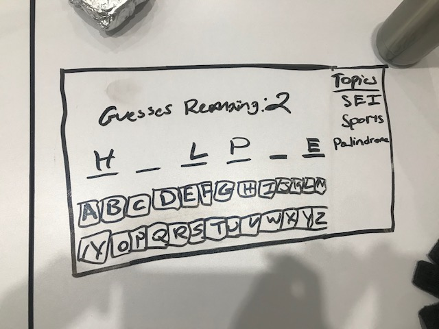

# HangmanSEI
## Overview 
for project 1, I created a version of the game **hangman**. 

Once players come to the site, they are asked to input their names. The plyaer will then pick from a list of 3 topics and once selected the player will get a random to guess. The player has 6 guesses to get the correct word.

## Technologies Used
* Languages - HTML, CSS, Javascript
* Design - Bootstrap, Google Fonts
* Project Planning & User Stories - [Trello](https://trello.com/b/14JFzrrR/project-1-game).
* VS code. 

## WireFrame 

## Future Developments/Improvements
* Display a hangman as either ASCII art or images that represent the various stages of the hangman.